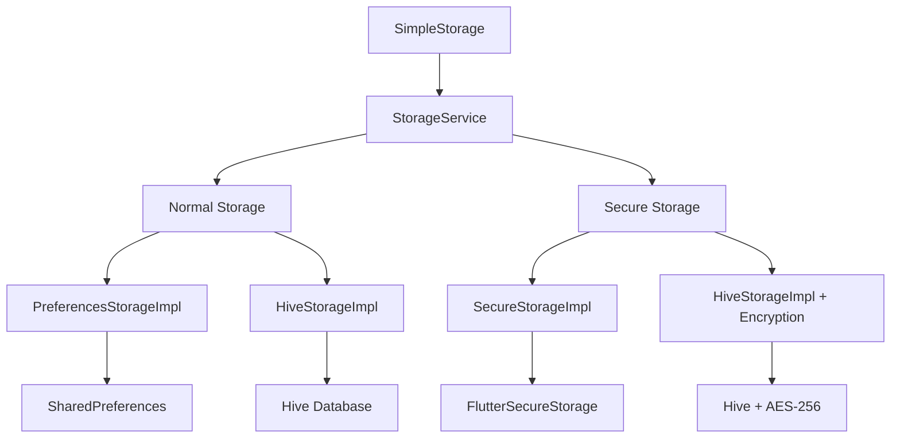

# Flutter Infra 🏗️

A comprehensive Flutter package providing clean, type-safe local storage solutions with multiple storage backends and security options.

## ✨ Features

- 🎯 **Multiple Storage Backends**: SharedPreferences, FlutterSecureStorage, and Hive support
- 🔐 **Security First**: Clear separation between normal and secure storage operations  
- 🧩 **Type Safety**: Built-in support for JSON, lists, DateTime, and custom objects
- ⚡ **Performance**: Optional caching and optimized storage implementations
- 🔧 **Dependency Injection**: Clean DI support with flexible configuration
- 📱 **Cross Platform**: Works on iOS, Android, Web, Windows, macOS, and Linux
- 🧪 **Fully Tested**: Comprehensive test coverage with mock support

## 🚀 Quick Start

### 1. Add to pubspec.yaml

```yaml
dependencies:
  flutter_infra: ^0.0.1
```

### 2. Simple Usage

```dart
import 'package:flutter_infra/flutter_infra.dart';

void main() async {
  WidgetsFlutterBinding.ensureInitialized();
  
  // Initialize with default storage implementations
  await SimpleStorage.init();
  
  runApp(MyApp());
}

// Use anywhere in your app
await SimpleStorage.setString('username', 'john_doe');
final username = await SimpleStorage.getString('username');

// Secure storage for sensitive data
await SimpleStorage.setSecureString('api_token', 'secret_token');
final token = await SimpleStorage.getSecureString('api_token');
```

## 🏗️ Architecture Overview



### Core Components

| Component | Purpose | Use Case |
|-----------|---------|----------|
| **SimpleStorage** | Static wrapper for quick access | Simple app-wide storage |
| **StorageService** | DI-friendly service class | Complex apps with DI |
| **PreferencesStorageImpl** | SharedPreferences backend | Basic key-value storage |
| **SecureStorageImpl** | FlutterSecureStorage backend | Sensitive data (tokens, passwords) |
| **HiveStorageImpl** | Hive database backend | High-performance storage with optional encryption |

## 📚 API Reference

### SimpleStorage (Static Methods)

#### Normal Storage
```dart
// String operations
await SimpleStorage.setString('key', 'value');
final value = await SimpleStorage.getString('key');

// Boolean operations  
await SimpleStorage.setBool('isLoggedIn', true);
final isLoggedIn = await SimpleStorage.getBool('isLoggedIn');

// Key management
final exists = await SimpleStorage.hasKey('key');
await SimpleStorage.deleteKey('key');
await SimpleStorage.clearAll();
```

#### Secure Storage
```dart
// Secure string operations
await SimpleStorage.setSecureString('token', 'secret');
final token = await SimpleStorage.getSecureString('token');

// Secure boolean operations
await SimpleStorage.setSecureBool('biometricsEnabled', true);
final enabled = await SimpleStorage.getSecureBool('biometricsEnabled');

// Secure key management
final exists = await SimpleStorage.hasSecureKey('token');
await SimpleStorage.deleteSecureKey('token');
await SimpleStorage.clearAllSecure();
```

### Storage Implementations

#### PreferencesStorageImpl
```dart
final storage = await PreferencesStorageImpl.getInstance(
  config: StorageConfig(enableCache: true, enableLogging: true),
);

await storage.setString('key', 'value');
final value = await storage.getString('key');
```

#### SecureStorageImpl  
```dart
final storage = SecureStorageImpl.getInstance(
  config: StorageConfig(enableLogging: true),
);

await storage.setString('sensitive_key', 'sensitive_value');
final value = await storage.getString('sensitive_key');
```

#### HiveStorageImpl
```dart
// Normal Hive storage
final storage = await HiveStorageImpl.getInstance(
  boxName: 'user_data',
  config: StorageConfig(enableLogging: true),
);

// Encrypted Hive storage
final secureStorage = await HiveStorageImpl.getInstance(
  boxName: 'secure_data',
  encryptionKey: 'your-secret-key',
  config: StorageConfig(enableLogging: true),
);
```

### Typed Extensions

All storage implementations support typed operations:

```dart
// JSON objects
final user = {'name': 'John', 'age': 30};
await storage.setJson('user', user);
final retrievedUser = await storage.getJson('user');

// String lists
await storage.setStringList('tags', ['flutter', 'dart']);
final tags = await storage.getStringList('tags');

// DateTime objects
await storage.setDateTime('lastLogin', DateTime.now());
final lastLogin = await storage.getDateTime('lastLogin');
```

## 🔧 Dependency Injection

### Basic DI Setup

```dart
import 'package:get_it/get_it.dart';
import 'package:flutter_infra/flutter_infra.dart';

final getIt = GetIt.instance;

Future<void> setupDependencies() async {
  // Register storage implementations
  final normalStorage = await PreferencesStorageImpl.getInstance(
    config: StorageConfig(enableCache: true),
  );
  
  final secureStorage = SecureStorageImpl.getInstance(
    config: StorageConfig(enableLogging: true),
  );
  
  // Register storage service
  getIt.registerSingleton<StorageService>(
    StorageService(
      normalStorage: normalStorage,
      secureStorage: secureStorage,
    ),
  );
  
  // Register repositories
  getIt.registerLazySingleton<UserRepository>(
    () => UserRepository(getIt<StorageService>()),
  );
  
  getIt.registerLazySingleton<SettingsRepository>(
    () => SettingsRepository(getIt<StorageService>()),
  );
}

void main() async {
  WidgetsFlutterBinding.ensureInitialized();
  await setupDependencies();
  runApp(MyApp());
}
```

### Repository Pattern Examples

```dart
class UserRepository {
  final StorageService _storage;
  
  UserRepository(this._storage);
  
  Future<void> saveUser(User user) async {
    await _storage.setJson('user', user.toJson());
  }
  
  Future<User?> getUser() async {
    final userData = await _storage.getJson('user');
    return userData != null ? User.fromJson(userData) : null;
  }
  
  Future<void> saveAuthToken(String token) async {
    await _storage.setSecureString('auth_token', token);
  }
  
  Future<String?> getAuthToken() async {
    return await _storage.getSecureString('auth_token');
  }
}

class SettingsRepository {
  final StorageService _storage;
  
  SettingsRepository(this._storage);
  
  Future<void> setTheme(String theme) async {
    await _storage.setString('theme', theme);
  }
  
  Future<String> getTheme() async {
    return await _storage.getString('theme', defaultValue: 'light') ?? 'light';
  }
  
  Future<void> setBiometricsEnabled(bool enabled) async {
    await _storage.setSecureBool('biometrics_enabled', enabled);
  }
  
  Future<bool> isBiometricsEnabled() async {
    return await _storage.getSecureBool('biometrics_enabled');
  }
}
```

### Widget Usage

```dart
class UserProfilePage extends StatelessWidget {
  @override
  Widget build(BuildContext context) {
    final userRepo = getIt<UserRepository>();
    
    return FutureBuilder<User?>(
      future: userRepo.getUser(),
      builder: (context, snapshot) {
        if (snapshot.hasData) {
          return Text('Welcome, ${snapshot.data!.name}');
        }
        return CircularProgressIndicator();
      },
    );
  }
}
```

## ⚙️ Configuration

### StorageConfig Options

```dart
const config = StorageConfig(
  enableLogging: true,          // Enable debug logging
  enableCache: true,            // Enable in-memory caching
  cacheTimeout: Duration(minutes: 30), // Cache timeout
  encryptionKey: 'secret-key',  // Optional encryption key
  customSettings: {             // Custom implementation settings
    'hive_box_name': 'custom_box',
    'secure_storage_options': {...},
  },
);
```

### Custom Storage Implementation

```dart
class CustomStorageImpl implements LocalStorage {
  @override
  Future<bool> setString(String key, String value) async {
    // Your custom implementation
    return true;
  }
  
  @override
  Future<String?> getString(String key, {String? defaultValue}) async {
    // Your custom implementation
    return defaultValue;
  }
  
  // ... implement other methods
}

// Use in StorageService
final customStorage = CustomStorageImpl();
final service = StorageService(normalStorage: customStorage);
```

## 🧪 Testing

### Test Setup

```dart
import 'package:flutter_test/flutter_test.dart';
import 'package:mockito/mockito.dart';
import 'package:flutter_infra/flutter_infra.dart';

class MockStorage extends Mock implements LocalStorage {}

void main() {
  group('UserRepository Tests', () {
    late UserRepository repository;
    late MockStorage mockStorage;
    
    setUp(() {
      mockStorage = MockStorage();
      final service = StorageService(
        normalStorage: mockStorage,
        secureStorage: mockStorage,
      );
      repository = UserRepository(service);
    });
    
    test('should save and retrieve user', () async {
      final user = User(name: 'John', email: 'john@example.com');
      
      when(mockStorage.setJson('user', any))
          .thenAnswer((_) async => true);
      when(mockStorage.getJson('user'))
          .thenAnswer((_) async => user.toJson());
      
      await repository.saveUser(user);
      final retrievedUser = await repository.getUser();
      
      expect(retrievedUser?.name, 'John');
    });
  });
}
```

## 📝 Migration Guide

### From v0.0.1 to Current

#### Before (Old Architecture)
```dart
// Old way with boolean parameter
await storage.setString('key', 'value', secure: false);
await storage.setString('token', 'secret', secure: true);
```

#### After (New Architecture)
```dart
// New way with separate methods
await storage.setString('key', 'value');        // Normal storage
await storage.setSecureString('token', 'secret'); // Secure storage

// Or with SimpleStorage
await SimpleStorage.setString('key', 'value');
await SimpleStorage.setSecureString('token', 'secret');
```

## 🤝 Contributing

1. Fork the repository
2. Create your feature branch (`git checkout -b feature/amazing-feature`)
3. Commit your changes (`git commit -m 'Add amazing feature'`)
4. Push to the branch (`git push origin feature/amazing-feature`)
5. Open a Pull Request

## 📄 License

This project is licensed under the MIT License - see the [LICENSE](LICENSE) file for details.

## 🙏 Acknowledgments

- [SharedPreferences](https://pub.dev/packages/shared_preferences) for reliable local storage
- [FlutterSecureStorage](https://pub.dev/packages/flutter_secure_storage) for secure storage capabilities
- [Hive](https://pub.dev/packages/hive) for high-performance NoSQL database
