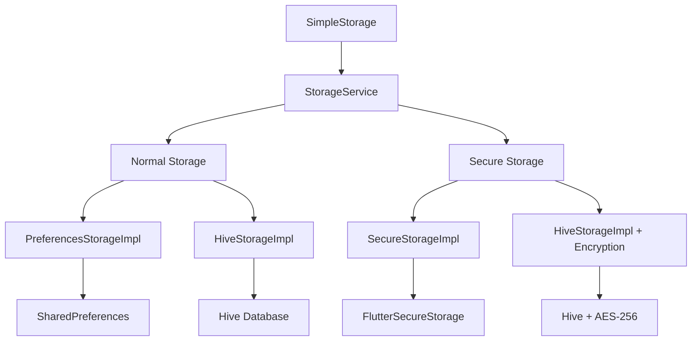

# Flutter Infra 🏗️

A comprehensive Flutter package providing clean, type-safe local storage solutions with multiple storage backends and security options.

## ✨ Features

- 🎯 **Multiple Storage Backends**: SharedPreferences, FlutterSecureStorage, and Hive support
- 🔐 **Security First**: Clear separation between normal and secure storage operations  
- 🧩 **Type Safety**: Built-in support for JSON, lists, DateTime, and custom objects with both normal and secure versions
- ⚡ **Performance**: Optional caching and optimized storage implementations
- 🔧 **Dependency Injection**: Clean DI support with flexible configuration
- 📱 **Cross Platform**: Works on iOS, Android, Web, Windows, macOS, and Linux
- 🧪 **Fully Tested**: Comprehensive test coverage with 170+ tests and mock support

## 🚀 Quick Start

### 1. Add to pubspec.yaml

```yaml
dependencies:
  flutter_infra: ^0.0.1
```

### 2. Simple Usage

```dart
import 'package:flutter_infra/flutter_infra.dart';

void main() async {
  WidgetsFlutterBinding.ensureInitialized();
  
  // Initialize with default storage implementations
  await SimpleStorage.init();
  
  runApp(MyApp());
}

// Use anywhere in your app
await SimpleStorage.setString('username', 'john_doe');
final username = await SimpleStorage.getString('username');

// Secure storage for sensitive data
await SimpleStorage.setSecureString('api_token', 'secret_token');
final token = await SimpleStorage.getSecureString('api_token');
```

## 🏗️ Architecture Overview



### Core Components

| Component | Purpose | Use Case |
|-----------|---------|----------|
| **SimpleStorage** | Static wrapper for quick access | Simple app-wide storage |
| **StorageService** | DI-friendly service class with typed extensions | Complex apps with DI |
| **PreferencesStorageImpl** | SharedPreferences backend | Basic key-value storage |
| **SecureStorageImpl** | FlutterSecureStorage backend | Sensitive data (tokens, passwords) |
| **HiveStorageImpl** | Hive database backend | High-performance storage with optional encryption |

## 📚 API Reference

### SimpleStorage (Static Methods)

#### Normal Storage
```dart
// String operations
await SimpleStorage.setString('key', 'value');
final value = await SimpleStorage.getString('key');

// Boolean operations  
await SimpleStorage.setBool('isLoggedIn', true);
final isLoggedIn = await SimpleStorage.getBool('isLoggedIn');

// Key management
final exists = await SimpleStorage.hasKey('key');
await SimpleStorage.deleteKey('key');
await SimpleStorage.clearAll();
```

#### Secure Storage
```dart
// Secure string operations
await SimpleStorage.setSecureString('token', 'secret');
final token = await SimpleStorage.getSecureString('token');

// Secure boolean operations
await SimpleStorage.setSecureBool('biometricsEnabled', true);
final enabled = await SimpleStorage.getSecureBool('biometricsEnabled');

// Secure key management
final exists = await SimpleStorage.hasSecureKey('token');
await SimpleStorage.deleteSecureKey('token');
await SimpleStorage.clearAllSecure();
```

### Storage Implementations

#### PreferencesStorageImpl
```dart
final storage = await PreferencesStorageImpl.getInstance(
  config: StorageConfig(enableCache: true, enableLogging: true),
);

await storage.setString('key', 'value');
final value = await storage.getString('key');
```

#### SecureStorageImpl  
```dart
final storage = SecureStorageImpl.getInstance(
  config: StorageConfig(enableLogging: true),
);

await storage.setString('sensitive_key', 'sensitive_value');
final value = await storage.getString('sensitive_key');
```

#### HiveStorageImpl
```dart
// Normal Hive storage
final storage = await HiveStorageImpl.getInstance(
  boxName: 'user_data',
  config: StorageConfig(enableLogging: true),
);

// Encrypted Hive storage
final secureStorage = await HiveStorageImpl.getInstance(
  boxName: 'secure_data',
  encryptionKey: 'your-secret-key',
  config: StorageConfig(enableLogging: true),
);
```

### 🧩 Typed Extensions on StorageService

StorageService includes powerful typed extensions for complex data with **both normal and secure versions**:

#### JSON Operations
```dart
final service = await StorageService.create();

// Normal JSON storage
final userData = {'name': 'John', 'age': 30, 'email': 'john@example.com'};
await service.setJson('user', userData);
final user = await service.getJson('user');

// Secure JSON storage for sensitive data
final credentials = {'token': 'abc123', 'refreshToken': 'xyz789'};
await service.setSecureJson('auth', credentials);
final auth = await service.getSecureJson('auth');
```

#### String List Operations  
```dart
// Normal string lists
const tags = ['flutter', 'dart', 'mobile'];
await service.setStringList('user_tags', tags);
final userTags = await service.getStringList('user_tags');

// Secure string lists for sensitive data
const permissions = ['admin', 'write', 'delete'];
await service.setSecureStringList('user_permissions', permissions);
final userPermissions = await service.getSecureStringList('user_permissions');
```

#### DateTime Operations
```dart
// Normal DateTime storage
final loginTime = DateTime.now();
await service.setDateTime('last_login', loginTime);
final lastLogin = await service.getDateTime('last_login');

// Secure DateTime storage for sensitive timestamps
final tokenExpiry = DateTime.now().add(Duration(hours: 24));
await service.setSecureDateTime('token_expiry', tokenExpiry);
final expiry = await service.getSecureDateTime('token_expiry');
```

#### Complete Typed Operations Example
```dart
final service = await StorageService.create();

// User profile (normal storage)
await service.setJson('profile', {
  'name': 'John Doe',
  'email': 'john@example.com',
  'preferences': {'theme': 'dark', 'notifications': true}
});

await service.setStringList('interests', ['tech', 'music', 'travel']);
await service.setDateTime('profile_updated', DateTime.now());

// Authentication data (secure storage)
await service.setSecureJson('auth_tokens', {
  'access_token': 'eyJhbGciOiJIUzI1NiIs...',
  'refresh_token': 'dGhpcyBpcyBhIHJlZnJlc2g...'
});

await service.setSecureStringList('roles', ['user', 'premium']);
await service.setSecureDateTime('session_expires', DateTime.now().add(Duration(hours: 2)));

// Retrieve data
final profile = await service.getJson('profile');
final interests = await service.getStringList('interests');
final lastUpdated = await service.getDateTime('profile_updated');

final authTokens = await service.getSecureJson('auth_tokens');
final userRoles = await service.getSecureStringList('roles');
final sessionExpiry = await service.getSecureDateTime('session_expires');
```

## 🔧 Dependency Injection

### Basic DI Setup

```dart
import 'package:get_it/get_it.dart';
import 'package:flutter_infra/flutter_infra.dart';

final getIt = GetIt.instance;

Future<void> setupDependencies() async {
  // Register storage implementations
  final normalStorage = await PreferencesStorageImpl.getInstance(
    config: StorageConfig(enableCache: true),
  );
  
  final secureStorage = SecureStorageImpl.getInstance(
    config: StorageConfig(enableLogging: true),
  );
  
  // Register storage service with typed extensions
  getIt.registerSingleton<StorageService>(
    StorageService(
      normalStorage: normalStorage,
      secureStorage: secureStorage,
    ),
  );
  
  // Register repositories
  getIt.registerLazySingleton<UserRepository>(
    () => UserRepository(getIt<StorageService>()),
  );
  
  getIt.registerLazySingleton<SettingsRepository>(
    () => SettingsRepository(getIt<StorageService>()),
  );
}

void main() async {
  WidgetsFlutterBinding.ensureInitialized();
  await setupDependencies();
  runApp(MyApp());
}
```

### Repository Pattern Examples

```dart
class UserRepository {
  final StorageService _storage;
  
  UserRepository(this._storage);
  
  Future<void> saveUser(User user) async {
    // Use typed JSON extension
    await _storage.setJson('user_profile', user.toJson());
    await _storage.setDateTime('profile_updated', DateTime.now());
  }
  
  Future<User?> getUser() async {
    final userData = await _storage.getJson('user_profile');
    return userData != null ? User.fromJson(userData) : null;
  }
  
  Future<void> saveAuthTokens(String accessToken, String refreshToken) async {
    // Use secure typed JSON extension
    await _storage.setSecureJson('auth_tokens', {
      'access_token': accessToken,
      'refresh_token': refreshToken,
    });
    await _storage.setSecureDateTime('token_created', DateTime.now());
  }
  
  Future<Map<String, dynamic>?> getAuthTokens() async {
    return await _storage.getSecureJson('auth_tokens');
  }
  
  Future<void> saveUserPreferences(List<String> interests, Map<String, dynamic> settings) async {
    // Use typed extensions for complex data
    await _storage.setStringList('user_interests', interests);
    await _storage.setJson('user_settings', settings);
  }
  
  Future<List<String>?> getUserInterests() async {
    return await _storage.getStringList('user_interests');
  }
}

class SettingsRepository {
  final StorageService _storage;
  
  SettingsRepository(this._storage);
  
  Future<void> setTheme(String theme) async {
    await _storage.setString('theme', theme);
  }
  
  Future<String> getTheme() async {
    return await _storage.getString('theme', defaultValue: 'light') ?? 'light';
  }
  
  Future<void> setBiometricsEnabled(bool enabled) async {
    // Biometric settings are sensitive - use secure storage
    await _storage.setSecureBool('biometrics_enabled', enabled);
  }
  
  Future<bool> isBiometricsEnabled() async {
    return await _storage.getSecureBool('biometrics_enabled');
  }
  
  Future<void> saveAppSettings(Map<String, dynamic> settings) async {
    await _storage.setJson('app_settings', settings);
    await _storage.setDateTime('settings_updated', DateTime.now());
  }
  
  Future<DateTime?> getLastSettingsUpdate() async {
    return await _storage.getDateTime('settings_updated');
  }
}
```

### Widget Usage

```dart
class UserProfilePage extends StatelessWidget {
  @override
  Widget build(BuildContext context) {
    final userRepo = getIt<UserRepository>();
    
    return FutureBuilder<User?>(
      future: userRepo.getUser(),
      builder: (context, snapshot) {
        if (snapshot.hasData) {
          return Column(
            children: [
              Text('Welcome, ${snapshot.data!.name}'),
              FutureBuilder<List<String>?>(
                future: userRepo.getUserInterests(),
                builder: (context, interestsSnapshot) {
                  if (interestsSnapshot.hasData) {
                    return Wrap(
                      children: interestsSnapshot.data!
                          .map((interest) => Chip(label: Text(interest)))
                          .toList(),
                    );
                  }
                  return CircularProgressIndicator();
                },
              ),
            ],
          );
        }
        return CircularProgressIndicator();
      },
    );
  }
}
```

## ⚙️ Configuration

### StorageConfig Options

```dart
const config = StorageConfig(
  enableLogging: true,          // Enable debug logging
  enableCache: true,            // Enable in-memory caching
  cacheTimeout: Duration(minutes: 30), // Cache timeout
  encryptionKey: 'secret-key',  // Optional encryption key
  customSettings: {             // Custom implementation settings
    'hive_box_name': 'custom_box',
    'secure_storage_options': {...},
  },
);
```

### Custom Storage Implementation

```dart
class CustomStorageImpl implements LocalStorage {
  @override
  Future<bool> setString(String key, String value) async {
    // Your custom implementation
    return true;
  }
  
  @override
  Future<String?> getString(String key, {String? defaultValue}) async {
    // Your custom implementation
    return defaultValue;
  }
  
  // ... implement other methods
}

// Use in StorageService
final customStorage = CustomStorageImpl();
final service = StorageService(normalStorage: customStorage);

// Now you have typed extensions on your custom storage!
await service.setJson('data', {'custom': 'implementation'});
await service.setStringList('items', ['a', 'b', 'c']);
await service.setDateTime('timestamp', DateTime.now());
```

## 🧪 Testing

### Test Organization

Tests are organized into focused, maintainable files:

- **`preferences_storage_impl_test.dart`** - SharedPreferences functionality (22 tests)
- **`secure_storage_impl_test.dart`** - FlutterSecureStorage functionality (25 tests)
- **`storage_service_test.dart`** - Service delegation logic (71 tests)
- **`storage_config_test.dart`** - Configuration options (16 tests)
- **`typed_storage_ext_test.dart`** - Typed extensions with normal/secure variants (36 tests)

### Test Setup

```dart
import 'package:flutter_test/flutter_test.dart';
import 'package:mockito/mockito.dart';
import 'package:flutter_infra/flutter_infra.dart';

class MockStorage extends Mock implements LocalStorage {}

void main() {
  group('UserRepository Tests', () {
    late UserRepository repository;
    late MockStorage mockNormalStorage;
    late MockStorage mockSecureStorage;
    
    setUp(() {
      mockNormalStorage = MockStorage();
      mockSecureStorage = MockStorage();
      final service = StorageService(
        normalStorage: mockNormalStorage,
        secureStorage: mockSecureStorage,
      );
      repository = UserRepository(service);
    });
    
    test('should save and retrieve user with typed extensions', () async {
      final user = User(name: 'John', email: 'john@example.com');
      
      // Mock typed JSON operations
      when(mockNormalStorage.setString('user_profile', any))
          .thenAnswer((_) async => true);
      when(mockNormalStorage.getString('user_profile', defaultValue: anyNamed('defaultValue')))
          .thenAnswer((_) async => '{"name":"John","email":"john@example.com"}');
      
      await repository.saveUser(user);
      final retrievedUser = await repository.getUser();
      
      expect(retrievedUser?.name, 'John');
      verify(mockNormalStorage.setString('user_profile', any)).called(1);
    });
    
    test('should handle secure token operations', () async {
      const accessToken = 'access123';
      const refreshToken = 'refresh456';
      
      when(mockSecureStorage.setString('auth_tokens', any))
          .thenAnswer((_) async => true);
      when(mockSecureStorage.getString('auth_tokens', defaultValue: anyNamed('defaultValue')))
          .thenAnswer((_) async => '{"access_token":"access123","refresh_token":"refresh456"}');
      
      await repository.saveAuthTokens(accessToken, refreshToken);
      final tokens = await repository.getAuthTokens();
      
      expect(tokens?['access_token'], accessToken);
      expect(tokens?['refresh_token'], refreshToken);
      verify(mockSecureStorage.setString('auth_tokens', any)).called(1);
    });
  });
}
```

### Running Tests

```bash
# Run all tests (170+ tests)
flutter test

# Run specific test suites
flutter test test/storage_service_test.dart
flutter test test/typed_storage_ext_test.dart

# Run with coverage
flutter test --coverage
```

## 📝 Migration Guide

### From v0.0.1 to Current

#### Before (Old Architecture)
```dart
// Old way with boolean parameter
await storage.setString('key', 'value', secure: false);
await storage.setString('token', 'secret', secure: true);

// Limited typed operations
final json = storage.getJson('data'); // Only on LocalStorage
```

#### After (New Architecture)
```dart
// New way with separate methods
await storage.setString('key', 'value');        // Normal storage
await storage.setSecureString('token', 'secret'); // Secure storage

// Rich typed operations on StorageService
await service.setJson('user', userData);         // Normal JSON
await service.setSecureJson('auth', authData);   // Secure JSON
await service.setStringList('tags', tagList);    // Normal list
await service.setSecureStringList('roles', roles); // Secure list
await service.setDateTime('login', DateTime.now()); // Normal DateTime
await service.setSecureDateTime('expire', expiry);  // Secure DateTime

// Or with SimpleStorage
await SimpleStorage.setString('key', 'value');
await SimpleStorage.setSecureString('token', 'secret');
```

## 🤝 Contributing

1. Fork the repository
2. Create your feature branch (`git checkout -b feature/amazing-feature`)
3. Add comprehensive tests for your changes
4. Commit your changes (`git commit -m 'Add amazing feature'`)
5. Push to the branch (`git push origin feature/amazing-feature`)
6. Open a Pull Request

## 📄 License

This project is licensed under the MIT License - see the [LICENSE](LICENSE) file for details.

## 🙏 Acknowledgments

- [SharedPreferences](https://pub.dev/packages/shared_preferences) for reliable local storage
- [FlutterSecureStorage](https://pub.dev/packages/flutter_secure_storage) for secure storage capabilities
- [Hive](https://pub.dev/packages/hive) for high-performance NoSQL database
