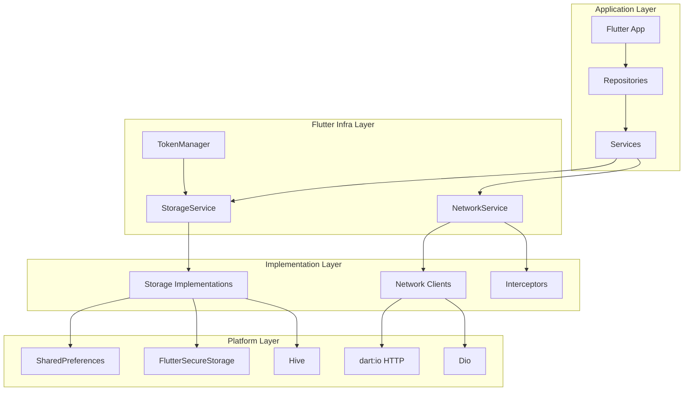
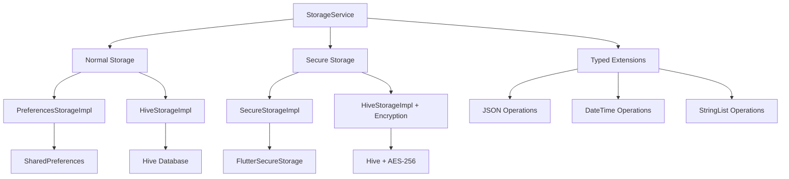
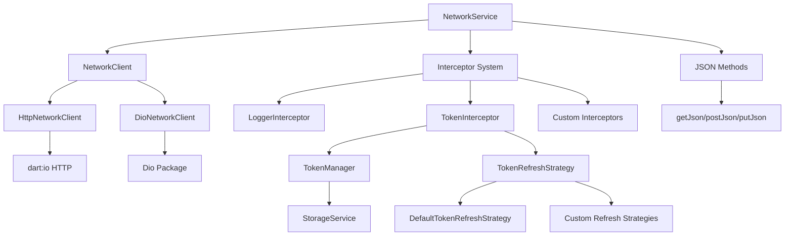
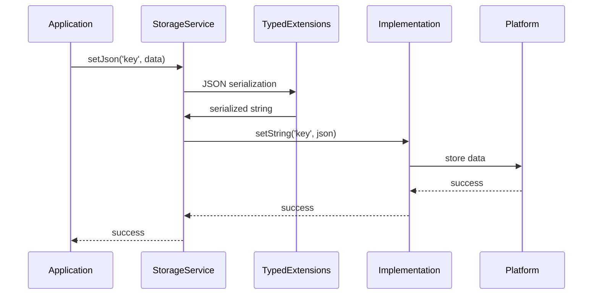
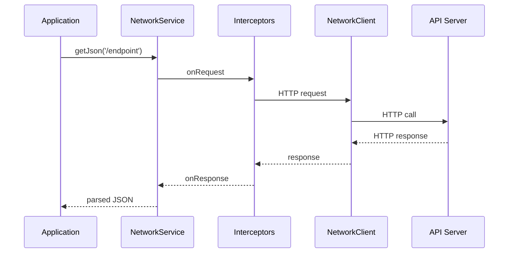
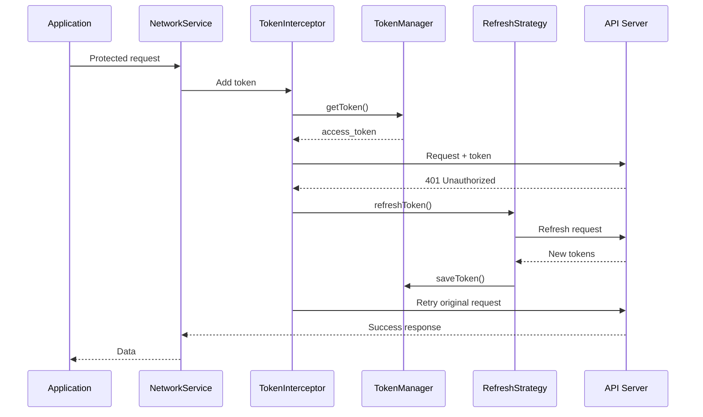

# 🏗️ Architecture Overview

Understanding the design and structure of Flutter Infra.

## 📖 Table of Contents
- [System Architecture](#system-architecture)
- [Storage Architecture](#storage-architecture)
- [Network Architecture](#network-architecture)
- [Core Components](#core-components)
- [Design Patterns](#design-patterns)
- [Data Flow](#data-flow)

## 🎯 System Architecture

Flutter Infra follows a layered architecture with clear separation of concerns:



## 💾 Storage Architecture

### Component Hierarchy


### Storage Implementations

#### PreferencesStorageImpl
- **Purpose**: Basic key-value storage using SharedPreferences
- **Use Cases**: User preferences, app settings, simple data
- **Performance**: Fast access, limited storage size
- **Security**: Not secure, data stored in plain text

#### SecureStorageImpl
- **Purpose**: Secure storage using FlutterSecureStorage
- **Use Cases**: Authentication tokens, passwords, sensitive data
- **Performance**: Slower than normal storage due to encryption
- **Security**: Hardware-backed encryption on supported devices

#### HiveStorageImpl
- **Purpose**: High-performance NoSQL database
- **Use Cases**: Large datasets, complex objects, caching
- **Performance**: Very fast read/write operations
- **Security**: Optional AES-256 encryption

### Typed Extensions Layer
Provides type-safe operations for complex data structures:
- **JSON Operations**: Automatic serialization/deserialization
- **DateTime Operations**: ISO 8601 string conversion
- **StringList Operations**: Array handling with validation

## 🌐 Network Architecture

### Component Hierarchy


### Network Clients

#### HttpNetworkClient
- **Implementation**: Built on dart:io HTTP
- **Benefits**: Lightweight, no external dependencies
- **Use Cases**: Simple applications, minimal networking needs
- **Limitations**: Basic error handling, limited features

#### DioNetworkClient
- **Implementation**: Built on Dio package
- **Benefits**: Advanced features, detailed error information
- **Use Cases**: Complex applications, advanced networking needs
- **Features**: Built-in retry, request/response transformation

### Interceptor System
- **Request Interception**: Modify outgoing requests
- **Response Interception**: Process incoming responses
- **Error Handling**: Global error processing
- **Token Management**: Automatic authentication handling

## 🔧 Core Components

### Storage Components
| Component | Responsibility | Dependencies |
|-----------|---------------|--------------|
| **StorageService** | High-level storage interface | LocalStorage implementations |
| **PreferencesStorageImpl** | SharedPreferences wrapper | SharedPreferences |
| **SecureStorageImpl** | Secure storage wrapper | FlutterSecureStorage |
| **HiveStorageImpl** | Hive database wrapper | Hive |
| **StorageConfig** | Configuration management | None |
| **Typed Extensions** | Type-safe operations | JSON encoding/decoding |

### Network Components
| Component | Responsibility | Dependencies |
|-----------|---------------|--------------|
| **NetworkService** | High-level HTTP interface | NetworkClient |
| **HttpNetworkClient** | HTTP implementation | dart:io |
| **DioNetworkClient** | Dio implementation | Dio package |
| **NetworkConfig** | Configuration management | None |
| **LoggerInterceptor** | Request/response logging | None |
| **TokenInterceptor** | Token management | TokenManager |

### Token Management Components
| Component | Responsibility | Dependencies |
|-----------|---------------|--------------|
| **TokenManager** | Token storage interface | StorageService |
| **DefaultTokenManager** | Default implementation | StorageService |
| **TokenConfig** | Token configuration | None |
| **TokenRefreshStrategy** | Token refresh logic | NetworkService |
| **DefaultTokenRefreshStrategy** | Default refresh implementation | NetworkService, TokenManager |

## 🎨 Design Patterns

### Factory Pattern
```dart
// StorageService factory
final storageService = await StorageService.create();

// NetworkService factory
final networkService = await NetworkService.create(config: config);
```

### Strategy Pattern
```dart
// Token refresh strategies
abstract class TokenRefreshStrategy {
  Future<bool> refreshToken();
}

class CustomRefreshStrategy implements TokenRefreshStrategy {
  // Custom implementation
}
```

### Decorator Pattern
```dart
// Interceptors decorate network requests
final config = NetworkConfig(
  interceptors: [
    LoggerInterceptor(),
    TokenInterceptor(),
    CustomInterceptor(),
  ],
);
```

### Repository Pattern
```dart
class UserRepository {
  final StorageService _storage;
  final NetworkService _network;
  
  // Encapsulates data access logic
}
```

### Dependency Injection
```dart
// Clean separation of concerns
class UserService {
  final UserRepository _repository;
  
  UserService(this._repository);
}
```

## 🔄 Data Flow

### Storage Data Flow


### Network Data Flow


### Token Management Flow


## 🔗 Related Documentation

- [Storage Service Documentation](storage-service.md)
- [Network Service Documentation](network-service.md)
- [Token Management Documentation](token-management.md)
- [Configuration Guide](configuration.md)
- [Best Practices](best-practices.md) 